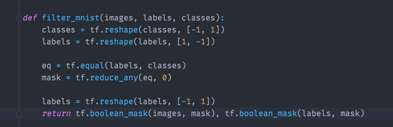
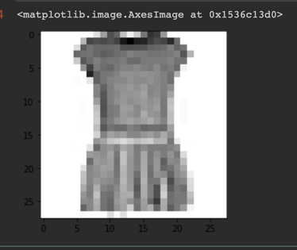
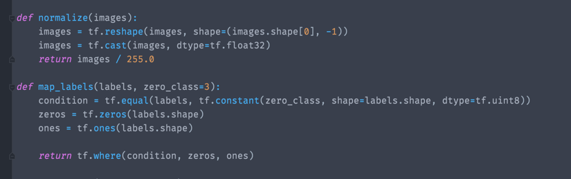
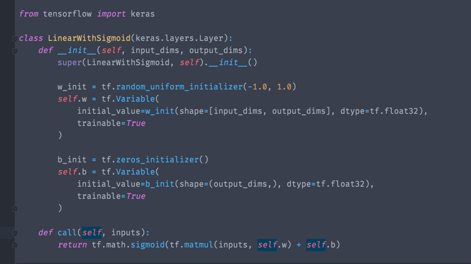
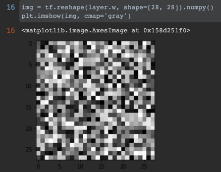
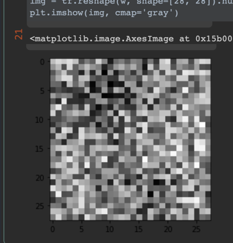

## Zadanie 1 - Regresja Logistyczna 

Patryk Wojtyczek

### Wybór Frameworka

Do wykonania zadania wybrałem framework TensorFlow głównie ze względu na popularność i na fakt, że na jednych zajęciach z ESUMu z niego korzystaliśmy. 

### Wczytanie Danych

Dane pobrałem (nie korzystałem z wbudowanych funkcji do pobierania danych :/) i wczytałem jako numpyowe wektory które przekształciłem do tensorów.  

Do wybrania tylko interesujących mnie klas skorzystałem z broadcastingu (który jak się okazuje działa bardzo podobnie w tf do numpy). 

 - utworzyłem tensor `classes` (#classes x 1) i wektor `labels` (1 x #labels)
 - przyrównałem te tensory otrzymując w efekcie tensor (#classes x #labels) o wartościach 0/1.
 - zsumowałem tensor po kolumnach (efektywnie robiąc funkcję `or`) i otrzymałem binarną maskę. 
 - zaaplikowałem maskę do `labels` i `images` otrzymując interesujące mnie dane.

### Przykładowa sukienka

### Modele w TF/Keras

W Kerasie podstawową abstrakcją jest `Layer`. Layer posiada wagi i wiedzę jak z wejścia zrobić wyjście (nadpisanie funkcji `call` tzw. forward pass). Stowrzenie własnego `Layer` sprowadza się do rozszerzenia klasy `Layer`.

Sam `Model` to kombinacja `Layers` i posiada API do szkolenia, ewaluacji i serializacji wyszkolonego modelu. 

### Normalizacja danych i ustawienie klas jako prawd.

- Tutaj wystarczyło utworzyć tensor z jedynek i zer a następnie wykorzystać funkcję where która brałaby element w zależności od condition (które powstało jako przyrównanie `labels` do jednej z klas).

- normalizacja to z kolei tylko podzielenie przez 255 aby uzyskać przeział `[0, 1]`
 

### Debugowanie

Tensorflow od wersji 2.0 wspiera tzw eager tensors czyli nie wymaga budowania grafu obliczeń co pozwala na interaktywne uruchamianie fragmentów kodu (aka łatwe debugowanie). Jest też tzw. `tf.Function`, który buduje graf obliczeń i tam debugowanie nie jest już takie łatwe. 

## Implementacja modelu

Cały model to sieć neuronowa z jedną warstwą (784) => (1).
Nadpisałem `Layer` gdzie nadpisałem metodę call obliczającą `sigmoid(w * x + b)`. 

\pagebreak
Początkowe wagi to losowe wartości.

## Szkolenie

Do szkolenia wykorzystałem gotowe funkcje `SGD` (stochastic gradient descent) i `BinaryCrossEntropy`.

## Wyniki

Uzyskana dokładność modelu jest zaskakująco wysoka.

\pagebreak
## Wagi po szkoleniu

Dalej sprawiają wrażenie bycia bardziej szumem (co jest odrobinę zastanawiające) ale to pewnie przez nieliniowość (sigmoidę).

