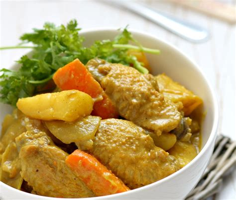

# Zadanie 4 -Zalewamy wrzątkiem chińską zupkę, czyli tym razem nasza sieć przygotowana jest z użyciem gotowej bazy

Patryk Wojtyczek

## Dane

Wybrałem następujące klasy:

- Chicken: `hong kong chicken`
- Dumplings: `dumplings`
- Salmon: `salmon`

Do załadowania zbioru danych wykorzystałem  `tf.keras.preprocessing.image_dataset_from_directory`.
Do podziału zbioru danych na dwie części wykorzystuję parametr `seed` i `validation_split`.

Załadowane egzemplarze wyglądają następująco

## Sieci konwolucyjne na bazie gotowej kostki rosołowej

### Sieć z poprzedniego laboratorium

Szkolona od zera sieć z poprzedniego laboratorium uzyskała następujące wyniki:

### Transfer Learning z wyszkoloną siecią z poprzedniego laboratorium

Aby zapewnić, żeby batch-normalization działało w trybie inferencji przekazujemy parametr `training=False` gdy
wołamy base_model. Zamrażamy cały model poprzez ustawienie flagi `base_model.trainable=False`.

Po liczbie `trainable params` widać, że wagi tylko ostatniej warstwy mogą się zmieniać.

Uzyskane wyniki

Faktycznie wygląda to jakby dla naszej sieci poprzednio wyuczone wagi to było za mało.

### Transfer Learning z modelem Xception

I uzyskane wyniki, wystarczyło kilka epok aby sieć uzyskała bardzo dobry wynik na zbiorze
walidacyjnym.

\newpage

### Fine-tuning modelu

Rozmrażamy wagi modelu. Batch-normalization nadal działa w trybie inferencji ze względu na przekazany
wcześniej parametr `training=False`. Parametr uczenia `learning_rate` jest ustawiony na znacznie
niższą wartość niż poprzednio.

Uzyskane wyniki

Na wykresach nieszczególnie widać zmianę, ale udało się podnieść `accuracy` z .87 do .90.

\newpage

## No dobra, ale w sumie na jakiej podstawie taka sieć podejmuje decyzje?

Po wrzuceniu do sieci takiego obrazka (kurczaka)

Kilka pierwszych z brzegu aktywacji wygląda w taki sposób. Mają rozdzielczość 8x8 
ale przy rysowaniu zrobiłem interpolację `billinear`.

Po narzuceniu heatmap na obrazek (i zwiększeniu rozdzielczości) wygląda to następująco.

\newpage

Kod do obliczania sumarycznej heatmapy:

I otrzymujemy

Co wygląda sensownie - sieć skupiła się głównie na środkowym fragmencie który istotnie 
mówi, że na zdjęciu jest kurczak.

Heatmapy dla pozostałych wybranych fotografii

Faktycznie widać, że sieć skupiała się na istotnych miejscach - poza drugim trzecim zdjęciem
w pierwszym rzędzie gdzie skupiła się na jakimś pobocznym fragmencie i źle sklasyfikowała dany obraz - jako pierogi
zamiast kurczaka.

\newpage

Do odnalezienia fotografii, z którymi sieć sobie nie poradziła, porównałem predykcje z rzeczywistymi wynikami.
Niepoprawnie sklasyfikowanych było 32. 

Niektóre z nich raczej nie powinny się tu znaleźć - np. niedźwiedź trzymający rybę klasyfikowany
jak kurczak wydaje się być swego rodzaju edge-casem. Puszka pewnie była tylko w zbiorze walidacyjnym.
A co do pozostałych to faktycznie można zobaczyć na jakich miejscach sieć się skupiła choć dalej nie wiadomo czemu
taką a nie inną decyzję podjęła - np. dla rysunku z pierogami wygląda jakby wybrała istotne do podjęcia decyzji miejsca
natomiast uważa, że jest to łosoś. Jest też kilka takch zdjęć z którymi sam miałbym trudność powiedzieć co tam jest.

